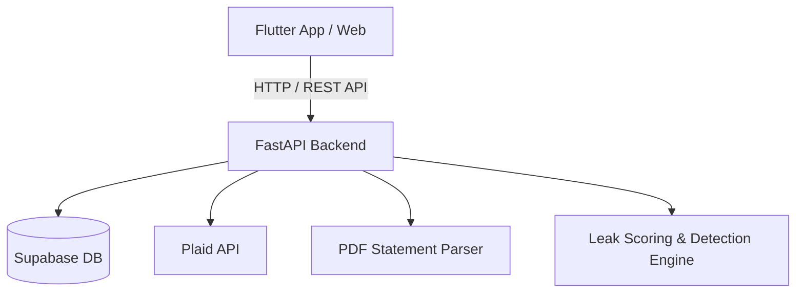

# SubSense 💳⚡
> **Hidden Subscription & Recurring Payment Leak Detector**

SubSense is an intelligent financial health tool designed to automatically scan transaction histories (bank statements, Plaid links, SMS, or emails) to detect recurring subscriptions, identify silent price hikes, compute a personalized **Leak Score**, and offer concrete action plans (Cancel, Downgrade, Renegotiate) to stop money leaks.

---

## 🌟 Key Features

- 🔍 **Automated Subscription Detection**: Scans and identifies recurring payments from bank statements (PDFs) or live Plaid bank connections.
- 📈 **Price Hike & Anomaly Alerts**: Flags sneaky price increases and unexpected billing changes over time.
- 📊 **Financial Health / Leak Score**: Calculates a dynamic score (15–98) based on leakage ratio, price hikes, category duplicates, and high-cost non-essentials.
- 🎯 **Actionable Recommendations**: Categorizes every subscription into clear, actionable outcomes:
  - ❌ **Cancel** (unneeded/idle subscriptions)
  - ⬇️ **Downgrade** (over-provisioned plans)
  - 🤝 **Renegotiate** (potential for better rates or discounts)
- 🧮 **Interactive Subscription Simulator**: Dynamic client-side score recalculation allowing users to test potential savings in real-time.
- 📱 **Multi-Platform Support**: Built with Flutter for Seamless Web, Mobile, and Desktop support.

---

## 🏗️ Architecture & Tech Stack



- **Frontend**: Flutter (Dart) — Supports Web, Windows, macOS, Android, iOS
- **Backend**: FastAPI (Python 3.9+) — REST API server with data ingestion & analytics algorithms
- **Database & Auth**: Supabase (PostgreSQL & Supabase Auth)
- **Financial Data Integration**: Plaid Sandbox API & `pdfplumber` for statement parsing

---

## 📂 Repository Structure

```text
InnovaHack/
├── sub_sense_app/          # Flutter Frontend Application
│   ├── lib/                # UI screens, providers, models & services
│   ├── pubspec.yaml        # Flutter dependencies
│   └── web/ android/ ios/  # Platform build targets
├── sub_sense_backend/      # FastAPI Backend Server
│   ├── main.py             # FastAPI entry point & routes
│   ├── auth.py             # Supabase authentication logic
│   ├── database.py         # DB connection & models
│   ├── detection/          # Subscription & anomaly detection engine
│   ├── ingestion/          # PDF & statement parsing modules
│   └── requirements.txt    # Python dependencies
└── Docs/                   # Specifications, problem statement & scoring formulas
```

---

## 🚀 Getting Started & Setup Guide

### 1. Prerequisites
Ensure your machine has the following installed:
- [Git](https://git-scm.com/)
- [Python 3.9+](https://www.python.org/)
- [Flutter SDK](https://docs.flutter.dev/get-started/install)

---

### 2. Backend Setup (`sub_sense_backend`)

1. **Navigate to the backend directory**:
   ```bash
   cd sub_sense_backend
   ```

2. **Create & Activate a Python Virtual Environment**:
   - **Windows (PowerShell)**:
     ```powershell
     python -m venv venv
     .\venv\Scripts\Activate.ps1
     ```
   - **Windows (CMD)**:
     ```cmd
     python -m venv venv
     .\venv\Scripts\activate.bat
     ```
   - **macOS / Linux**:
     ```bash
     python3 -m venv venv
     source venv/bin/activate
     ```

3. **Install Dependencies**:
   ```bash
   pip install -r requirements.txt
   ```

4. **Environment Configuration**:
   Create a `.env` file in `sub_sense_backend/` with the following variables:
   ```env
   SUPABASE_URL=https://hwakgblslcqmdyvxbggn.supabase.co
   SUPABASE_KEY=<YOUR_SUPABASE_ANON_KEY>
   PLAID_CLIENT_ID=<YOUR_PLAID_CLIENT_ID>
   PLAID_SECRET=<YOUR_PLAID_SECRET>
   PLAID_ENV=sandbox
   ```

5. **Start the Backend Server**:
   ```bash
   uvicorn main:app --reload --port 8000
   ```
   *Backend will run at:* `http://127.0.0.1:8000`

---

### 3. Frontend Setup (`sub_sense_app`)

Open a **new terminal window** and follow these steps:

1. **Navigate to the frontend directory**:
   ```bash
   cd sub_sense_app
   ```

2. **Fetch Flutter Dependencies**:
   ```bash
   flutter pub get
   ```

3. **Run the App**:
   - **Web (Chrome)**:
     ```bash
     flutter run -d chrome
     ```
   - **Windows Desktop**:
     ```bash
     flutter run -d windows
     ```
   - **macOS Desktop**:
     ```bash
     flutter run -d macos
     ```
   - **Mobile Device / Emulator**:
     ```bash
     flutter run
     ```

---

## 🧮 Leak Score Formula

$$\text{Raw Score} = 100 - \text{Leakage Ratio Penalty} - \text{Price Hike Penalties} - \text{Duplicate Penalties} - \text{High Cost Penalties}$$
$$\text{Final Score} = \text{Clamp}(\text{Raw Score}, 15, 98)$$

- **Leakage Ratio Penalty**: $50 \times \left( \frac{\text{Leakage Amount}}{\text{Total Subscription Spend}} \right)$
- **Price Hike Penalty**: $-5$ points per price increase detected
- **Category Duplicate Penalty**: $-10$ points per set of duplicate subscriptions
- **High-Cost Non-Essential**: $-5$ points per `Cancel`-recommended item $> ₹500/\text{mo}$

---

## 📄 License & Credits
Developed for **InnovaHack**.
